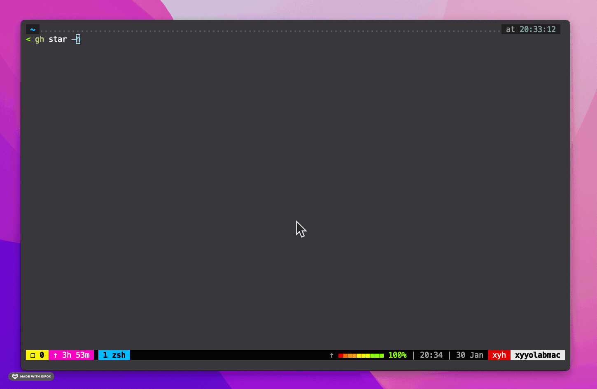

# `gh star` GitHub CLI extension

[GitHub CLI](https://github.com/cli/cli) extension to fuzzy search starred repo using [fzf](https://github.com/junegunn/fzf#readme).

## Installation
```
gh extension install keidarcy/gh-star
```

## Usage
```
gh star
```

<details>
  <summary>Expand for Demo</summary>

  
</details>

Displays an interactive starred repo picker and show URL to open.
